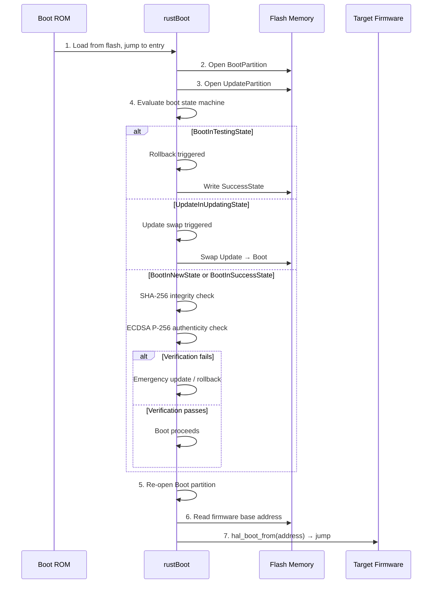
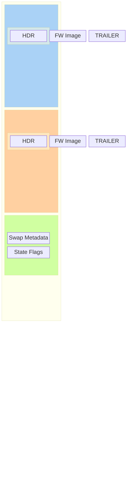
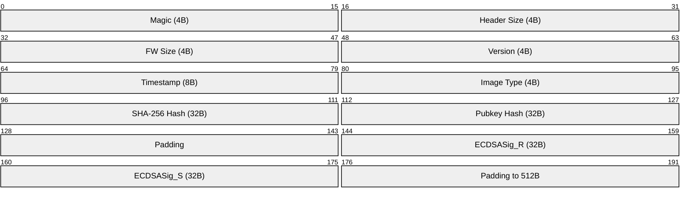
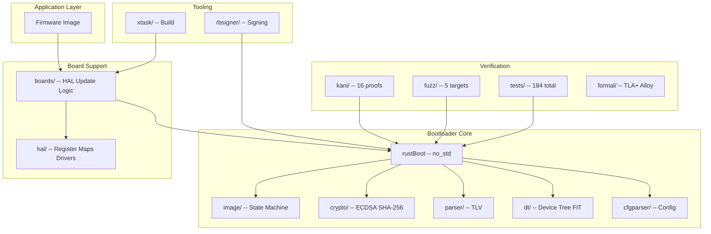

# rustBoot Architecture

## System Overview

rustBoot is a `no_std` Rust secure bootloader implementing A/B firmware
updates with ECDSA (NIST P-256) image verification. It supports both
custom TLV image format (bare-metal) and Flattened Image Tree (FIT)
format (Linux booting) on Cortex-M and AArch64 targets.

## Boot Flow

<!-- docs/diagrams/boot-flow.mmd -->


## Partition Layout

<!-- docs/diagrams/partition-layout.mmd -->


Three partitions managed by `PartDescriptor`:

- **BootPartition**: Active firmware slot (boots from here)
- **UpdatePartition**: Update staging slot (new firmware written here)
- **SwapPartition**: Swap metadata and rollback state

Each partition contains:
- Image header (TLV format): version, timestamp, type, digests, signature
- Firmware binary
- Trailer: state flags, magic number

## State Machine

<!-- docs/diagrams/state-machine.mmd -->
```mermaid
stateDiagram-v2
    [*] --> BootInNewState : Power-on

    state BootInNewState {
        [*] --> VerifyIntegrity
        VerifyIntegrity --> VerifyAuthenticity
        VerifyAuthenticity --> BootReady
    }

    BootInNewState --> BootInTestingState : into_testing_state()
    BootInTestingState --> BootInSuccessState : into_success_state()
    BootInTestingState --> BootInNewState : rollback

    state UpdateInNewState {
        [*] --> WaitingForUpdate
    }

    UpdateInNewState --> UpdateInUpdatingState : into_updating_state()
    UpdateInUpdatingState --> BootInTestingState : swap complete

    note right of BootInNewState : State: 0xFF\nFresh image
    note right of BootInTestingState : State: 0x70\nUnder test
    note right of BootInSuccessState : State: 0x00\nConfirmed
```

Five `ImageType` states with four valid transitions:

```
BootInNewState ──► BootInTestingState ──► BootInSuccessState
                      │
                      └── (rollback → BootInNewState, via update_trigger)

UpdateInNewState ──► UpdateInUpdatingState
```

All 20 remaining transition pairs are invalid and return
`RustbootError::InvalidState`.

## Image Formats

### TLV Format (native)

<!-- docs/diagrams/image-format.mmd -->


Fixed-size header (512 bytes) with Type-Length-Value fields:
- Magic, Version, Timestamp, Image Type
- SHA-256 hash, Public key hash, ECDSA signature
- Firmware binary follows header

### FIT Format (Linux)
Flattened Image Tree format with device tree structure:
- Hash nodes (SHA-256 per sub-image)
- Signature nodes (ECDSA per configuration)
- Configurations binding kernel, FDT, ramdisk

## Cryptographic Verification

- **ECDSA P-256**: `NistP256Signature::verify()` via `DigestVerifier` trait
- **SHA-256**: `verify_integrity()` computes digest of firmware region
- **Public Key**: Embedded at compile time in `import_pubkey()`

## Crate Architecture

<!-- docs/diagrams/crate-architecture.mmd -->


```
rustBoot/          Core no_std library (parsers, crypto, state machine, DT)
rbsigner/          CLI signing tool (std, for host builds)
xtask/             Build system helper (std)
boards/            Board support packages
  hal/             Hardware abstraction layer (register maps, drivers)
  update/          A/B swap logic (rustboot_start entry point)
  bootloaders/     Per-MCU main.rs entry points
  firmware/        Example firmware images
```

## Verification Architecture

- **Unit tests**: 164 covering parsers, crypto, state machine, DT ops
- **Integration tests**: 20 covering state transitions, constants, types
- **Kani proofs**: 16 bounded verification harnesses
- **Fuzz targets**: 5 (TLV header, FIT parser, DTB parser, config parser)
- **Property tests**: 3 proptest properties (parse safety, roundtrip, flags)
- **Formal models**: TLA+ and Alloy for state machine invariants

## Safety Case

See `docs/safety_case.md` for the full safety argument covering 7 safety
goals (G1-G7), 8 documented hazards, and a complete verification matrix.

## Directory Layout

```
rustBoot/src/
  lib.rs            — Crate root, lint denies
  image/image.rs    — Boot state machine, partition management
  image/parse.rs    — TLV header parser
  crypto/signatures.rs — ECDSA verification
  dt/               — Device tree (reader, writer, patcher, FIT parser)
  cfgparser.rs      — Update config parser
  rbconstants.rs    — Global constants

docs/
  architecture/     — This document
  safety_case.md    — NATO-grade safety argument
  threat-model/     — STRIDE threat model
  fmea/             — FMEA with RPN scoring
  requirements/     — Requirements traceability
  formal/           — TLA+ and Alloy formal models
  verification/     — Test matrix and verification evidence
  qemu_testing.md   — QEMU integration guide
  wcet.md           — Stack depth and WCET analysis
```